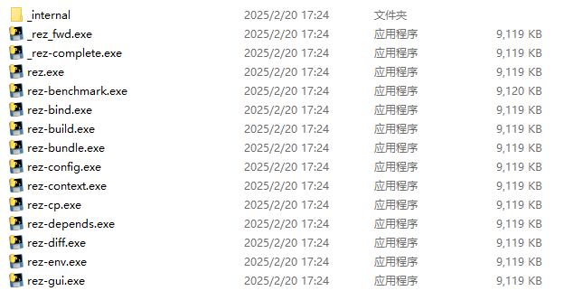

# Portable Rez Build by PyInstaller

This is an unofficial portable build of Rez created with PyInstaller. It offers a standalone executable for Windows, allowing you to run Rez without installing Python.

The build functions identically to the official version.



Original Rez repository: [AcademySoftwareFoundation/rez](https://github.com/AcademySoftwareFoundation/rez)  
Rez documentation: [rez.readthedocs.io](https://rez.readthedocs.io/en/stable/index.html)

## Usage

1. Download the latest release from [Latest Releases](https://github.com/FhyTan/portable_rez/releases).
2. Extract the ZIP file to your preferred folder.
3. Add that folder to your PATH environment variable.

You can now use `rez` from the command line as you would with the official build.

## Build

This repository currently provides a Windows build, but it can be adapted for other platforms or Python versions.

The build script is located in the `pyinstaller` folder. To create a build, install PyInstaller and run:

```bash
pip install pyinstaller
python ./pyinstaller/build.py
```

## Modifications

This repository differs from the official Rez version by including:

- The `pyinstaller` folder with the build script and necessary files.
- A fix for the longstanding UNC path issue.

Details:

- UNC path issue: [GitHub Issue #1438](https://github.com/AcademySoftwareFoundation/rez/issues/1438)
- Fix reference: [Rez TSC Notes 2023-03-16](https://github.com/AcademySoftwareFoundation/rez/blob/main/ASWF/TSC/meeting-notes/2023-03-16.md#environment-resolution-uses-unc-paths-with-python-310-37-was-using-mounted-network-drives-1438)
